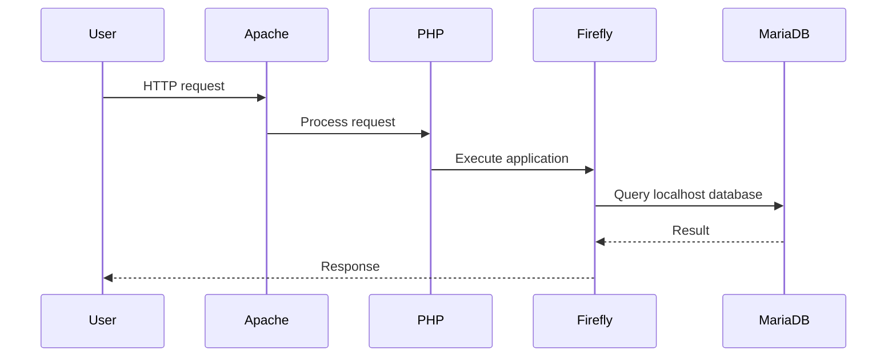

# Request Flow

```mermaid
sequenceDiagram
User->>Apache: HTTP request
Apache->>PHP: Process request
PHP->>Firefly: Execute application
Firefly->>MariaDB: Query localhost database
MariaDB-->>Firefly: Result
Firefly-->>User: Response
```
